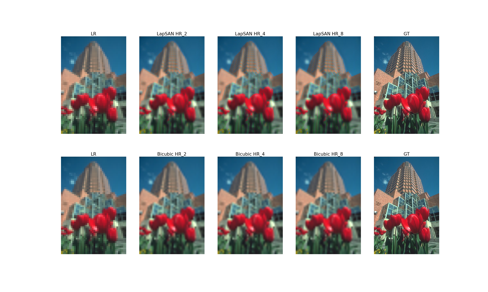

# Pytorch-LapSRN
A **unofficial** implementation of paper [Deep Laplacian Pyramid Networks for Fast and Accurate Super-Resolution](http://vllab1.ucmerced.edu/~wlai24/LapSRN/papers/cvpr17_LapSRN.pdf), the official MatConvNet implementation is here:[LapSRN](https://github.com/phoenix104104/LapSRN). The Network Architecture of this code is based on section.2 in the [supplementary material](http://vllab1.ucmerced.edu/~wlai24/LapSRN/papers/cvpr17_LapSRN_supp.pdf) of this peper.


# Prerequisites

- Linux
- Python
- NVIDIA GPU >= 4GB
- pytorch
- torchvision

# Usage

- Clone this repo:

```sh
git@github.com:BUPTLdy/Pytorch-LapSRN.git
```

- Train the model
```sh
python train.py --cuda
```

- Test the model

There is a pretrained model in the model folder, you can test the model directly.
```sh
python test.py --cuda
```


